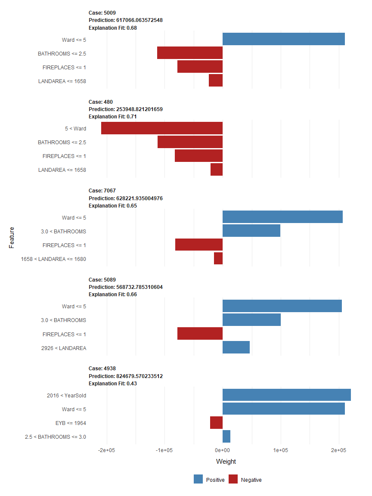

Neural Networks and Machine Learning Course Project
================
Leonid Shpaner
2022-11-19

# Part One

## Load the requisite libraries

``` r
pack <- function(lib){
  new.lib <- lib[!(lib %in% 
                     installed.packages()[, "Package"])]
  if (length(new.lib)) 
    install.packages(new.lib, dependencies = TRUE)
  sapply(lib, require, character.only = TRUE)
}

packages <- c('neuralnet', 'corrplot', 'caret', 'caTools', 'ggplot2', 'ggpubr',
              'cowplot', 'h2o', 'lime')
pack(packages)
```

    ## neuralnet  corrplot     caret   caTools   ggplot2    ggpubr   cowplot       h2o 
    ##      TRUE      TRUE      TRUE      TRUE      TRUE      TRUE      TRUE      TRUE 
    ##      lime 
    ##      TRUE

``` r
getwd() # establish current working directory
```

\[1\] “C:/Users/lshpaner/Documents/GitHub
Repositories/CEEM586_Neural_Networks_and_ML/code”

``` r
# set new working directory
working_dir = paste('C:/Users/lshpaner/OneDrive/Cornell University/Coursework/',
                    'CEEM586 - Neural Networks and Machine Learning/', sep='')
setwd(working_dir)
```

``` r
# Read in the data
election <- read.csv(paste("https://raw.githubusercontent.com/lshpaner/",
                           "CEEM586_Neural_Networks_and_ML/main/data/",
                           "ElectionData.csv", sep=""), row.names = 1, 
                     header = TRUE,
                     stringsAsFactors = FALSE)
```

## Preprocessing

``` r
# remove index column to better adapt to machine learning format
rownames(election) <- NULL
head(election) #inspect the df
```

    ##   fips US.regions PacificCoast MountainsPlains South Midwest Northeast
    ## 1 1001          3            0               0     1       0         0
    ## 2 1003          3            0               0     1       0         0
    ## 3 1005          3            0               0     1       0         0
    ## 4 1007          3            0               0     1       0         0
    ## 5 1009          3            0               0     1       0         0
    ## 6 1011          3            0               0     1       0         0
    ##   Population PercentFemale PercentWhite PercentAfricanAmerican
    ## 1  41435.460          51.4         77.9                   18.7
    ## 2 155686.358          51.2         87.1                    9.6
    ## 3  21186.956          46.6         50.2                   47.6
    ## 4  17779.740          45.9         76.3                   22.1
    ## 5  44097.316          50.5         96.0                    1.8
    ## 6   8460.504          45.3         26.9                   70.1
    ##   PercentNativeAmerican PercentAsian PercentHawaianPI PercentTwoorMore
    ## 1                   0.5          1.1              0.1              1.8
    ## 2                   0.7          0.9              0.1              1.6
    ## 3                   0.6          0.5              0.2              0.9
    ## 4                   0.4          0.2              0.1              0.9
    ## 5                   0.6          0.3              0.1              1.2
    ## 6                   0.8          0.3              0.7              1.1
    ##   PercentHispanic Percent.White.Not.Hispanic Percent.foreign.born
    ## 1             2.7                       75.6                  1.6
    ## 2             4.6                       83.0                  3.6
    ## 3             4.5                       46.6                  2.9
    ## 4             2.1                       74.5                  1.2
    ## 5             8.7                       87.8                  4.3
    ## 6             7.5                       22.1                  5.4
    ##   PercentLangDiffEnglish Bachlorsorhigher HighSchoolGrad HomeOwnership
    ## 1                    3.5             20.9           64.7          76.8
    ## 2                    5.5             27.7           61.4          72.6
    ## 3                    5.0             13.4           60.3          67.7
    ## 4                    2.1             12.1           65.4          79.0
    ## 5                    7.3             12.1           64.9          81.0
    ## 6                    5.2             12.5           55.3          74.3
    ##   PersonsPerHouse IncomeperCapita PercentBelowPoverty PopPerSqMile    Clinton
    ## 1            2.71           24571                12.1         91.8 0.23956855
    ## 2            2.52           26766                13.9        114.6 0.19565310
    ## 3            2.66           16829                26.7         31.0 0.46660250
    ## 4            3.03           17427                18.1         36.8 0.21422039
    ## 5            2.70           20730                15.8         88.9 0.08469902
    ## 6            2.73           18628                21.6         17.5 0.75090406
    ##       Trump
    ## 1 0.7343579
    ## 2 0.7735147
    ## 3 0.5227141
    ## 4 0.7696616
    ## 5 0.8985188
    ## 6 0.2422889

``` r
# remove Clinton from the dataframe
election_new <- election; election_new$Clinton <- NULL

head(election_new) # reinspect the new df
```

    ##   fips US.regions PacificCoast MountainsPlains South Midwest Northeast
    ## 1 1001          3            0               0     1       0         0
    ## 2 1003          3            0               0     1       0         0
    ## 3 1005          3            0               0     1       0         0
    ## 4 1007          3            0               0     1       0         0
    ## 5 1009          3            0               0     1       0         0
    ## 6 1011          3            0               0     1       0         0
    ##   Population PercentFemale PercentWhite PercentAfricanAmerican
    ## 1  41435.460          51.4         77.9                   18.7
    ## 2 155686.358          51.2         87.1                    9.6
    ## 3  21186.956          46.6         50.2                   47.6
    ## 4  17779.740          45.9         76.3                   22.1
    ## 5  44097.316          50.5         96.0                    1.8
    ## 6   8460.504          45.3         26.9                   70.1
    ##   PercentNativeAmerican PercentAsian PercentHawaianPI PercentTwoorMore
    ## 1                   0.5          1.1              0.1              1.8
    ## 2                   0.7          0.9              0.1              1.6
    ## 3                   0.6          0.5              0.2              0.9
    ## 4                   0.4          0.2              0.1              0.9
    ## 5                   0.6          0.3              0.1              1.2
    ## 6                   0.8          0.3              0.7              1.1
    ##   PercentHispanic Percent.White.Not.Hispanic Percent.foreign.born
    ## 1             2.7                       75.6                  1.6
    ## 2             4.6                       83.0                  3.6
    ## 3             4.5                       46.6                  2.9
    ## 4             2.1                       74.5                  1.2
    ## 5             8.7                       87.8                  4.3
    ## 6             7.5                       22.1                  5.4
    ##   PercentLangDiffEnglish Bachlorsorhigher HighSchoolGrad HomeOwnership
    ## 1                    3.5             20.9           64.7          76.8
    ## 2                    5.5             27.7           61.4          72.6
    ## 3                    5.0             13.4           60.3          67.7
    ## 4                    2.1             12.1           65.4          79.0
    ## 5                    7.3             12.1           64.9          81.0
    ## 6                    5.2             12.5           55.3          74.3
    ##   PersonsPerHouse IncomeperCapita PercentBelowPoverty PopPerSqMile     Trump
    ## 1            2.71           24571                12.1         91.8 0.7343579
    ## 2            2.52           26766                13.9        114.6 0.7735147
    ## 3            2.66           16829                26.7         31.0 0.5227141
    ## 4            3.03           17427                18.1         36.8 0.7696616
    ## 5            2.70           20730                15.8         88.9 0.8985188
    ## 6            2.73           18628                21.6         17.5 0.2422889

``` r
str(election_new[1,]) # inspect the structure of the df
```

    ## 'data.frame':    1 obs. of  27 variables:
    ##  $ fips                      : int 1001
    ##  $ US.regions                : int 3
    ##  $ PacificCoast              : int 0
    ##  $ MountainsPlains           : int 0
    ##  $ South                     : int 1
    ##  $ Midwest                   : int 0
    ##  $ Northeast                 : int 0
    ##  $ Population                : num 41435
    ##  $ PercentFemale             : num 51.4
    ##  $ PercentWhite              : num 77.9
    ##  $ PercentAfricanAmerican    : num 18.7
    ##  $ PercentNativeAmerican     : num 0.5
    ##  $ PercentAsian              : num 1.1
    ##  $ PercentHawaianPI          : num 0.1
    ##  $ PercentTwoorMore          : num 1.8
    ##  $ PercentHispanic           : num 2.7
    ##  $ Percent.White.Not.Hispanic: num 75.6
    ##  $ Percent.foreign.born      : num 1.6
    ##  $ PercentLangDiffEnglish    : num 3.5
    ##  $ Bachlorsorhigher          : num 20.9
    ##  $ HighSchoolGrad            : num 64.7
    ##  $ HomeOwnership             : num 76.8
    ##  $ PersonsPerHouse           : num 2.71
    ##  $ IncomeperCapita           : int 24571
    ##  $ PercentBelowPoverty       : num 12.1
    ##  $ PopPerSqMile              : num 91.8
    ##  $ Trump                     : num 0.734

``` r
cat("Dimensions of dataset:", dim(election_new), # dimensions of dataset
    "\n", "There are", sum(is.na(election_new)),  
    "'NA' values in the entire dataset.")
```

    ## Dimensions of dataset: 3143 27 
    ##  There are 0 'NA' values in the entire dataset.

## Exploratory Data Analysis (EDA)

### Correlation Matrix

``` r
# create a correl. matrix between all variables
frame_trump <- cor(election_new) 

corrplot(frame_trump, 
         mar = c(0, 0, 0, 0), 
         method="color",
         col=colorRampPalette(c("#FC0320", 
                                "white", 
                                "#FF0000"))(100), 
         addCoef.col = "black", tl.col="black", 
         tl.srt=6, tl.offset = 1,
         number.cex=0.55, tl.cex = 0.7, type='lower')
```


``` r
# assign variable to count how many highly correlated
# variables there exist based on 0.75 threshold
highCorr <- findCorrelation(frame_trump, cutoff = 0.75)

# find correlated names
highCorr_names <- findCorrelation(frame_trump, cutoff = 0.75, 
                                  names = TRUE)

cat("There are", 
    length(highCorr_names), 
    "highly correlated predictors. \n \n")
```

There are 5 highly correlated predictors.

``` r
highCorr_names
```

\[1\] “Percent.White.Not.Hispanic” “Percent.foreign.born”  
\[3\] “PercentLangDiffEnglish” “PercentWhite”  
\[5\] “Bachlorsorhigher”

### Correlation

Various economic indicators may shed light on election results. These
important variable relationships are examined in the ensuing scatter
plot diagrams. Plot A demonstrates that there exists a strong negative
correlation (*r* = -0.98) between Clinton’s fraction of Votes to that of
Trump’s. In Plot B, as income per capita decreases, the percent below
poverty increases, so there exists a strong negative relationship (*r* =
-0.73) between the two. Plot C shows that there is a weak (almost
moderate) relationship (*r* = -0.34) between home ownership and percent
below poverty; so, as the percent below poverty increases, home
ownership begins to decrease. Lastly, persons per house shares a low
correlation (*r* = 0.21) with percent below poverty, so it is difficult
to compare the two.

``` r
x1 = election$Trump; y1 = election$Clinton
corrplot1 <- ggplot(election, aes(x = x1, y = y1)) +
                    ggtitle("Clinton vs. Trump by Fraction of Votes") +
                    xlab('Trump') + ylab('Clinton') +
                    geom_point(pch=1) +
                    geom_smooth(method="lm", se=FALSE) +
                    theme_classic() +
                    # Add correlation coefficient
                    stat_cor(method = "pearson", label.x = 0.05, label.y = 0.02)

x2 = election$PercentBelowPoverty; y2 = election$IncomeperCapita
corrplot2 <- ggplot(election, aes(x = x2, y = y2)) +
                    ggtitle("Income Per Capita vs. Percent Below Poverty") +
                    xlab('Percent Below Poverty') + ylab('Income Per Capita') +
                    geom_point(pch=1) +
                    geom_smooth(method="lm", se=FALSE) +
                    theme_classic() +
                    # Add correlation coefficient
                    stat_cor(method = "pearson", label.x = 0.15, label.y = 0.20)

x3 = election$PercentBelowPoverty; y3 = election$HomeOwnership
corrplot3 <- ggplot(election, aes(x = x3, y = y3)) +
                    ggtitle("Home Ownership vs. Percent Below Poverty") +
                    xlab('Percent Below Poverty') + ylab('Home Ownership') +
                    geom_point(pch=1) +
                    geom_smooth(method="lm", se=FALSE) +
                    theme_classic() +
                    # Add correlation coefficient
                    stat_cor(method = "pearson", label.x = 0.15, label.y = 10)

x4 = election$PercentBelowPoverty; y4 = election$PersonsPerHouse
corrplot4 <- ggplot(election, aes(x = x4, y = y4)) +
                    ggtitle("Persons Per House vs. Percent Below Poverty") +
                    xlab('Percent Below Poverty') + ylab('Persons Per House') +
                    geom_point(pch=1) +
                    geom_smooth(method="lm", se=FALSE) +
                    theme_classic() +
                    # Add correlation coefficient
                    stat_cor(method = "pearson", label.x = 0.15, label.y = 0.20)

plot_grid(corrplot1, corrplot2, corrplot3, corrplot4, labels="AUTO", ncol = 2,
          align = "v")
```

    ## `geom_smooth()` using formula = 'y ~ x'
    ## `geom_smooth()` using formula = 'y ~ x'
    ## `geom_smooth()` using formula = 'y ~ x'
    ## `geom_smooth()` using formula = 'y ~ x'


``` r
# remove highly correlated predictors
election_new$Percent.White.Not.Hispanic <- NULL
election_new$Percent.foreign.born <- NULL 
election_new$PercentLangDiffEnglish <- NULL 
election_new$PercentWhite <- NULL 
election_new$Bachlorsorhigher <- NULL
```

## Partition The Data

The dataset is partitioned using a 70/30 train/test split

``` r
set.seed(222) # set seed for reproducibility
#Use 70% of dataset as training set and remaining 30% as testing set
sample <- sample(c(TRUE, FALSE), nrow(election_new), replace=TRUE, 
                 prob=c(0.7,0.3))
train  <- election_new[sample, ] # training set
test   <- election_new[!sample, ] # test set

cat("\n Training Dimensions:",dim(train),
    "\n Testing Dimensions:", dim(test), "\n",
    "\n Training Dimensions Percentage:", round(nrow(train)/
                                                nrow(election_new),2),
    "\n Testing Dimensions Percentage:", round(nrow(test)/
                                               nrow(election_new),2))
```

    ## 
    ##  Training Dimensions: 2186 22 
    ##  Testing Dimensions: 957 22 
    ##  
    ##  Training Dimensions Percentage: 0.7 
    ##  Testing Dimensions Percentage: 0.3

### Preprocessing via Normalization

``` r
# Create a function to normalize the data by scaling it between 0 and 1
normalize <- function(x) {return ((x-min(x))/(max(x)-min(x)))}

# Use the normalize function to normalize each column of train and test
# This creates a new dataframe by applying the normalize function to each row 
# of the dataset ‘frame’
maxmindtrain <- as.data.frame(lapply(train, normalize)) 
maxmindtest <- as.data.frame(lapply(test, normalize))
```

``` r
# Define input and output variables to create the training data data frame
input_train <- train[c(1:22)]
input_test <- test[c(1:22)]
output_train <- train$Trump # training output
output_test <- test$Trump # validation output
trainingdata <- cbind(input_train, output_train)
testdata <- cbind(input_test, output_test)
```

## Generalized Linear Model

``` r
set.seed(222)
lm.fit <- glm(Trump~., data=trainingdata)
summary(lm.fit)
```

    ## 
    ## Call:
    ## glm(formula = Trump ~ ., data = trainingdata)
    ## 
    ## Deviance Residuals: 
    ##        Min          1Q      Median          3Q         Max  
    ## -9.992e-16  -3.331e-16  -1.110e-16   2.220e-16   1.166e-15  
    ## 
    ## Coefficients: (2 not defined because of singularities)
    ##                          Estimate Std. Error    t value Pr(>|t|)    
    ## (Intercept)             1.112e-17  3.416e-16  3.300e-02 0.974031    
    ## fips                    1.419e-21  5.556e-22  2.555e+00 0.010698 *  
    ## US.regions             -1.938e-16  3.539e-17 -5.477e+00 4.83e-08 ***
    ## PacificCoast           -4.894e-16  1.230e-16 -3.980e+00 7.11e-05 ***
    ## MountainsPlains        -5.678e-16  8.248e-17 -6.885e+00 7.57e-12 ***
    ## South                  -5.426e-16  5.116e-17 -1.061e+01  < 2e-16 ***
    ## Midwest                        NA         NA         NA       NA    
    ## Northeast                      NA         NA         NA       NA    
    ## Population              5.198e-23  4.696e-23  1.107e+00 0.268464    
    ## PercentFemale           1.303e-17  3.783e-18  3.444e+00 0.000583 ***
    ## PercentAfricanAmerican  1.064e-17  8.595e-19  1.238e+01  < 2e-16 ***
    ## PercentNativeAmerican   3.026e-19  1.416e-18  2.140e-01 0.830823    
    ## PercentAsian            7.091e-18  4.264e-18  1.663e+00 0.096505 .  
    ## PercentHawaianPI        4.762e-18  8.261e-18  5.760e-01 0.564363    
    ## PercentTwoorMore       -5.311e-18  7.205e-18 -7.370e-01 0.461098    
    ## PercentHispanic        -4.935e-19  8.324e-19 -5.930e-01 0.553334    
    ## HighSchoolGrad         -1.252e-17  1.774e-18 -7.054e+00 2.32e-12 ***
    ## HomeOwnership          -3.491e-18  1.367e-18 -2.554e+00 0.010711 *  
    ## PersonsPerHouse        -3.482e-17  4.271e-17 -8.150e-01 0.415082    
    ## IncomeperCapita        -1.327e-21  3.025e-21 -4.380e-01 0.661080    
    ## PercentBelowPoverty    -6.857e-18  2.609e-18 -2.629e+00 0.008636 ** 
    ## PopPerSqMile            1.119e-20  8.475e-21  1.320e+00 0.187033    
    ## output_train            1.000e+00  5.303e-17  1.886e+16  < 2e-16 ***
    ## ---
    ## Signif. codes:  0 '***' 0.001 '**' 0.01 '*' 0.05 '.' 0.1 ' ' 1
    ## 
    ## (Dispersion parameter for gaussian family taken to be 1.43169e-31)
    ## 
    ##     Null deviance: 6.6136e+01  on 2185  degrees of freedom
    ## Residual deviance: 3.0996e-28  on 2165  degrees of freedom
    ## AIC: -149026
    ## 
    ## Number of Fisher Scoring iterations: 1

## Simple Neural Network Model

``` r
set.seed(222)
n_train <- names(trainingdata)
n_test <- names(testdata)

f_train <- as.formula(paste("Trump ~", paste(n_train[!n_train %in% "Trump"], 
                                             collapse = " + ")))
f_test <- as.formula(paste("Trump ~", paste(n_test[!n_test %in% "Trump"], 
                                            collapse = " + ")))

# 2 hidden layers with 5 and 3 neurons, respectively
nn_train <- neuralnet(f_train,data=trainingdata,hidden=c(5,3),linear.output=T) 
nn_test <- neuralnet(f_test,data=testdata,hidden=c(5,3), linear.output=T) 
plot(nn_train, rep = "best") # plot the neural network - training data
```


## Predict on Training Data and Test Data

``` r
set.seed(222) 
# Compute fitted values from the training data
predictions_train <- predict(nn_train, newdata=trainingdata)

# Test the neural networks out of sample performance
predictions_test <- predict(nn_test, newdata=testdata)
# Compute mean absolute error between true and fitted values
# we are wrong on average by this many fraction of votes

train_mae = mean(abs(predictions_train-output_train)) 
test_mae = mean(abs(predictions_test-output_test)) 

cat('\n', 'Train MAE:', train_mae,
    '\n', 'Test MAE:', test_mae,
    '\n', 'Difference in MAE Between Train and Validation Set:', 
     train_mae - test_mae)
```

    ## 
    ##  Train MAE: 0.1362437 
    ##  Test MAE: 0.1285449 
    ##  Difference in MAE Between Train and Validation Set: 0.007698762

# Part Two

## Initialize H2o

``` r
h2o.init()
```

    ##  Connection successful!
    ## 
    ## R is connected to the H2O cluster: 
    ##     H2O cluster uptime:         1 days 6 hours 
    ##     H2O cluster timezone:       America/Los_Angeles 
    ##     H2O data parsing timezone:  UTC 
    ##     H2O cluster version:        3.38.0.1 
    ##     H2O cluster version age:    2 months and 5 days  
    ##     H2O cluster name:           H2O_started_from_R_lshpaner_orw759 
    ##     H2O cluster total nodes:    1 
    ##     H2O cluster total memory:   3.60 GB 
    ##     H2O cluster total cores:    8 
    ##     H2O cluster allowed cores:  8 
    ##     H2O cluster healthy:        TRUE 
    ##     H2O Connection ip:          localhost 
    ##     H2O Connection port:        54321 
    ##     H2O Connection proxy:       NA 
    ##     H2O Internal Security:      FALSE 
    ##     R Version:                  R version 4.2.2 (2022-10-31 ucrt)

## Read in the data

``` r
housing <- read.csv(paste("https://raw.githubusercontent.com/lshpaner/",
                          "CEEM586_Neural_Networks_and_ML/main/data/",
                          "DC_PropertieResidentialunder1mill.csv", sep=""), 
                    header=TRUE)
head(housing[,1:10]) # examine first five columns of data
```

    ##      X.1 BATHRM HF_BATHRM BATHROOMS AC1IsYes NUM_UNITS ROOMS BEDRM  EYB STORIES
    ## 1 105692      3         1       3.5        1         1     8     3 2018       2
    ## 2 105499      2         0       2.0        0         1     6     2 1947       2
    ## 3  85758      2         0       2.0        0         2    10     4 1955       2
    ## 4  87741      1         0       1.0        0         1     5     2 1945       2
    ## 5 102505      1         0       1.0        0         1     4     2 1953       2
    ## 6  90764      1         0       1.0        0         1     4     1 1947       1

``` r
str(housing[1,]) # examine structure of dataframe
```

    ## 'data.frame':    1 obs. of  108 variables:
    ##  $ X.1                       : int 105692
    ##  $ BATHRM                    : int 3
    ##  $ HF_BATHRM                 : int 1
    ##  $ BATHROOMS                 : num 3.5
    ##  $ AC1IsYes                  : int 1
    ##  $ NUM_UNITS                 : int 1
    ##  $ ROOMS                     : int 8
    ##  $ BEDRM                     : int 3
    ##  $ EYB                       : int 2018
    ##  $ STORIES                   : num 2
    ##  $ YearSold                  : int 2018
    ##  $ Month                     : int 1
    ##  $ Winter                    : int 1
    ##  $ Spring                    : int 0
    ##  $ Summer                    : int 0
    ##  $ PRICE                     : int 51000
    ##  $ logPrice                  : num 4.71
    ##  $ GrossBuildingArea         : int 1476
    ##  $ RowInside                 : int 1
    ##  $ RowEnd                    : int 0
    ##  $ Multi                     : int 0
    ##  $ SemiDetached              : int 0
    ##  $ Single                    : int 0
    ##  $ TownEnd                   : int 0
    ##  $ TownInside                : int 0
    ##  $ GradeLowerBetter          : int 2
    ##  $ CNDTN                     : chr "Very Good"
    ##  $ EXTWALL                   : chr "Face Brick"
    ##  $ ROOF                      : chr "Comp Shingle"
    ##  $ INTWALL                   : chr "Hardwood"
    ##  $ KITCHENS                  : int 1
    ##  $ FIREPLACES                : int 0
    ##  $ USECODE                   : int 11
    ##  $ LANDAREA                  : int 1232
    ##  $ Residential_0.Condo_1     : int 0
    ##  $ ASSESSMENT_NBHD           : chr "Congress Heights"
    ##  $ CongressHeights           : int 1
    ##  $ Deanwood                  : int 0
    ##  $ RandleHeights             : int 0
    ##  $ FortDupontPark            : int 0
    ##  $ MichiganPark              : int 0
    ##  $ MarshallHeights           : int 0
    ##  $ ColumbiaHeights           : int 0
    ##  $ Brookland                 : int 0
    ##  $ Trinidad                  : int 0
    ##  $ Hillcrest                 : int 0
    ##  $ Burleith                  : int 0
    ##  $ Anacostia                 : int 0
    ##  $ LilyPonds                 : int 0
    ##  $ BarryFarms                : int 0
    ##  $ Petworth                  : int 0
    ##  $ Woodridge                 : int 0
    ##  $ OldCity1                  : int 0
    ##  $ Brentwood                 : int 0
    ##  $ Eckington                 : int 0
    ##  $ MtPleasant                : int 0
    ##  $ FortLincoln               : int 0
    ##  $ RiggsPark                 : int 0
    ##  $ StreetHeights16th         : int 0
    ##  $ OldCity2                  : int 0
    ##  $ TakomaPark                : int 0
    ##  $ Brightwood                : int 0
    ##  $ Chillum                   : int 0
    ##  $ CapitolHill               : int 0
    ##  $ LedroitPark               : int 0
    ##  $ ChevyChase                : int 0
    ##  $ ShepherdHeights           : int 0
    ##  $ Georgetown                : int 0
    ##  $ AmericanUniversity        : int 0
    ##  $ FoggyBottom               : int 0
    ##  $ Kent                      : int 0
    ##  $ WesleyHeights             : int 0
    ##  $ Palisades                 : int 0
    ##  $ GloverPark                : int 0
    ##  $ Crestwood                 : int 0
    ##  $ ClevelandPark             : int 0
    ##  $ ColonialVillage           : int 0
    ##  $ SouthwestWaterfront       : int 0
    ##  $ Foxhall                   : int 0
    ##  $ NorthClevelandPark        : int 0
    ##  $ Hawthorne                 : int 0
    ##  $ SpringValley              : int 0
    ##  $ Wakefield                 : int 0
    ##  $ Centraltri1               : int 0
    ##  $ Berkley                   : int 0
    ##  $ Garfield                  : int 0
    ##  $ ForestHills               : int 0
    ##  $ ObservatoryCircle         : int 0
    ##  $ Kalorama                  : int 0
    ##  $ Woodley                   : int 0
    ##  $ MassachusettsAvenueHeights: int 0
    ##  $ ASSESSMENT_SUBNBHD        : chr "016 B Congress Heights"
    ##  $ CENSUS_TRACT              : int 7304
    ##  $ CENSUS_BLOCK              : chr "007304 3005"
    ##  $ Ward                      : int 8
    ##  $ Ward2                     : int 0
    ##  $ Ward3                     : int 0
    ##  $ Ward4                     : int 0
    ##  $ Ward5                     : int 0
    ##   [list output truncated]

## Preprocessing

``` r
# remove non-numeric variables s.t. amendable to ML modeling
housing$CENSUS_BLOCK <- NULL
housing$BATHRM <- NULL # unrounded expression of bathrooms
housing$CNDTN <- NULL
housing$EXTWALL <- NULL
housing$ROOF <- NULL
housing$INTWALL <- NULL
housing$ASSESSMENT_SUBNBHD <- NULL
# contains 53 levels (already as variables/columns)
housing$ASSESSMENT_NBHD <- NULL
housing$SQUARE <- NULL
housing$QUADRANT <- NULL
# remove logPrice since PRICE is the target, and we do not
# need to linearize it
housing$logPrice <- NULL
housing$X <- NULL; housing$Y <- NULL # GPS coordiantes (x, y) --> not necessary
```

``` r
# supply names of columns that have 0 variance
names(housing[, sapply(housing, function(v) var(v, na.rm=TRUE)==0)])
```

    ## [1] "Single"                     "Residential_0.Condo_1"     
    ## [3] "Kalorama"                   "Woodley"                   
    ## [5] "MassachusettsAvenueHeights"

``` r
# exclude zero variance columns
housing <- housing[,sapply(housing, function(v) var(v, na.rm=TRUE)!=0)]
# dimensions of dataset
cat(" Dimensions of dataset:", dim(housing),
    "\n", "There are", sum(is.na(housing)), 
    "'NA' values in the entire dataset.")
```

    ##  Dimensions of dataset: 10617 90 
    ##  There are 180 'NA' values in the entire dataset.

``` r
# assign variable to count how many highly correlated
# variables there exist based on 0.75 threshold
highCorr_names <- findCorrelation(cor(housing, use="pairwise.complete.obs"),
cutoff = 0.75, names = TRUE)

highCorr <- findCorrelation(cor(housing), cutoff = 0.75)
cat(" There are", length(highCorr_names),
    "highly correlated predictors."); highCorr_names
```

    ##  There are 4 highly correlated predictors.

    ## [1] "NW"        "Ward6"     "Multi"     "NUM_UNITS"

``` r
# remove highly correlated predictors
housing$NW <- NULL
housing$Ward6 <- NULL
housing$Multi <- NULL
housing$NUM_UNITS <- NULL
# independent variables
X_var <- colnames(housing); X_var <- list(colnames(housing))
# remove response variable[-16] and index[-1] from list
X_var <- X_var[[1]][-15]; X_var <- X_var[-1]; X_var
```

    ##  [1] "HF_BATHRM"           "BATHROOMS"           "AC1IsYes"           
    ##  [4] "ROOMS"               "BEDRM"               "EYB"                
    ##  [7] "STORIES"             "YearSold"            "Month"              
    ## [10] "Winter"              "Spring"              "Summer"             
    ## [13] "PRICE"               "RowInside"           "RowEnd"             
    ## [16] "SemiDetached"        "TownEnd"             "TownInside"         
    ## [19] "GradeLowerBetter"    "KITCHENS"            "FIREPLACES"         
    ## [22] "USECODE"             "LANDAREA"            "CongressHeights"    
    ## [25] "Deanwood"            "RandleHeights"       "FortDupontPark"     
    ## [28] "MichiganPark"        "MarshallHeights"     "ColumbiaHeights"    
    ## [31] "Brookland"           "Trinidad"            "Hillcrest"          
    ## [34] "Burleith"            "Anacostia"           "LilyPonds"          
    ## [37] "BarryFarms"          "Petworth"            "Woodridge"          
    ## [40] "OldCity1"            "Brentwood"           "Eckington"          
    ## [43] "MtPleasant"          "FortLincoln"         "RiggsPark"          
    ## [46] "StreetHeights16th"   "OldCity2"            "TakomaPark"         
    ## [49] "Brightwood"          "Chillum"             "CapitolHill"        
    ## [52] "LedroitPark"         "ChevyChase"          "ShepherdHeights"    
    ## [55] "Georgetown"          "AmericanUniversity"  "FoggyBottom"        
    ## [58] "Kent"                "WesleyHeights"       "Palisades"          
    ## [61] "GloverPark"          "Crestwood"           "ClevelandPark"      
    ## [64] "ColonialVillage"     "SouthwestWaterfront" "Foxhall"            
    ## [67] "NorthClevelandPark"  "Hawthorne"           "SpringValley"       
    ## [70] "Wakefield"           "Centraltri1"         "Berkley"            
    ## [73] "Garfield"            "ForestHills"         "ObservatoryCircle"  
    ## [76] "CENSUS_TRACT"        "Ward"                "Ward2"              
    ## [79] "Ward3"               "Ward4"               "Ward5"              
    ## [82] "Ward7"               "NE"                  "SW"

## Partitioning The Data

``` r
# dataset is partitioned using a 70/30 train_test split as follows:
set.seed(222) # make this example reproducible
seventy_percent = 0.70*nrow(housing) # what is 70% of length of dataframe?
ind <- sample(1:nrow(housing), seventy_percent)
train_data <- as.h2o(housing[ind,]) # create training set as h2o data frame
test_data <- as.h2o(housing[-ind,]) # create test set as h2o data frame
```

``` r
cat(" Training Dimensions:", dim(train_data),
    "\n Testing Dimensions:", dim(test_data),
    "\n Training Percentage:", round(nrow(train_data)/nrow(housing),2),
    "\n Testing Percentage:", round(nrow(test_data)/nrow(housing), 2))
```

    ##  Training Dimensions: 7431 86 
    ##  Testing Dimensions: 3186 86 
    ##  Training Percentage: 0.7 
    ##  Testing Percentage: 0.3

## Estimate The Deep Neural Network

``` r
dl_DC_Properties1 <- h2o.deeplearning(y="PRICE", x=c(X_var), 
                                      training_frame=train_data,
                                      validation_frame=test_data, 
                                      activation="Tanh", 
                                      epochs=1000, hidden=c(4,4), 
                                      standardize=TRUE, 
                                      l1=0.0001, l2=0.001, 
                                      adaptive_rate=TRUE,
                                      variable_importances=TRUE,
                                      nfolds=3, reproducible=TRUE, 
                                      seed=222)
```

## Plot and Model Summary

The figure below shows the relationship between mean absolute error and
number of epochs for both the training and validation sets,
respectively. Generally, as the number of epochs increase, the MAE
decreases, but there is a wider gap between the training and validation
sets. The neural network is tuned with the `Tanh` activation function
over 1000 epochs, four hidden layers and four nodes, respectively, an
`l1` rate of 0.0001, and `l2` rate of 0.01. Moreover, the
`adaptive_rate`, `variable_importances`, and `reproducible`
hyperparameters are set to `TRUE`. Cross-validation is carried out over
3 folds.

``` r
plot(dl_DC_Properties1, metric='mae') # loss plotted throughout training
```


``` r
summary(dl_DC_Properties1) # Print model summary information
```

    ## Model Details:
    ## ==============
    ## 
    ## H2ORegressionModel: deeplearning
    ## Model Key:  DeepLearning_model_R_1669239665923_175 
    ## Status of Neuron Layers: predicting PRICE, regression, gaussian distribution, Quadratic loss, 361 weights/biases, 25.1 KB, 163,460 training samples, mini-batch size 1
    ##   layer units   type dropout       l1       l2 mean_rate rate_rms momentum
    ## 1     1    83  Input  0.00 %       NA       NA        NA       NA       NA
    ## 2     2     4   Tanh  0.00 % 0.000100 0.001000  0.006463 0.017503 0.000000
    ## 3     3     4   Tanh  0.00 % 0.000100 0.001000  0.002768 0.001816 0.000000
    ## 4     4     1 Linear      NA 0.000100 0.001000  0.001201 0.000268 0.000000
    ##   mean_weight weight_rms mean_bias bias_rms
    ## 1          NA         NA        NA       NA
    ## 2   -0.016761   0.112974 -0.062022 0.055470
    ## 3   -0.106086   0.360285 -0.018518 0.222929
    ## 4    0.171316   0.572101  0.043931 0.000000
    ## 
    ## H2ORegressionMetrics: deeplearning
    ## ** Reported on training data. **
    ## ** Metrics reported on full training frame **
    ## 
    ## MSE:  7427231127
    ## RMSE:  86181.39
    ## MAE:  65021.91
    ## RMSLE:  0.1709592
    ## Mean Residual Deviance :  7427231127
    ## 
    ## 
    ## H2ORegressionMetrics: deeplearning
    ## ** Reported on validation data. **
    ## ** Metrics reported on full validation frame **
    ## 
    ## MSE:  7853304605
    ## RMSE:  88618.87
    ## MAE:  66306.82
    ## RMSLE:  0.1721573
    ## Mean Residual Deviance :  7853304605
    ## 
    ## 
    ## H2ORegressionMetrics: deeplearning
    ## ** Reported on cross-validation data. **
    ## ** 3-fold cross-validation on training data (Metrics computed for combined holdout predictions) **
    ## 
    ## MSE:  7971277281
    ## RMSE:  89282.01
    ## MAE:  67263.08
    ## RMSLE:  0.1763725
    ## Mean Residual Deviance :  7971277281
    ## 
    ## 
    ## Cross-Validation Metrics Summary: 
    ##                                     mean               sd        cv_1_valid
    ## mae                         67252.914000      1395.125400      68825.600000
    ## mean_residual_deviance 7966297600.000000 562290750.000000 8594185000.000000
    ## mse                    7966297600.000000 562290750.000000 8594185000.000000
    ## r2                              0.835067         0.010278          0.823837
    ## residual_deviance      7966297600.000000 562290750.000000 8594185000.000000
    ## rmse                        89217.550000      3128.940000      92704.830000
    ## rmsle                           0.176283         0.005438          0.178552
    ##                               cv_2_valid        cv_3_valid
    ## mae                         66164.290000      66768.870000
    ## mean_residual_deviance 7795491300.000000 7509215700.000000
    ## mse                    7795491300.000000 7509215700.000000
    ## r2                              0.837359          0.844007
    ## residual_deviance      7795491300.000000 7509215700.000000
    ## rmse                        88292.080000      86655.734000
    ## rmsle                           0.180219          0.170078
    ## 
    ## Scoring History: 
    ##             timestamp   duration training_speed  epochs iterations      samples
    ## 1 2022-11-24 20:09:58  0.000 sec             NA 0.00000          0     0.000000
    ## 2 2022-11-24 20:09:58  3.425 sec  89518 obs/sec 0.99987          1  7430.000000
    ## 3 2022-11-24 20:09:58  3.581 sec  82555 obs/sec 1.99973          2 14860.000000
    ## 4 2022-11-24 20:09:58  3.744 sec  76862 obs/sec 2.99960          3 22290.000000
    ## 5 2022-11-24 20:09:58  3.923 sec  74673 obs/sec 3.99946          4 29720.000000
    ##   training_rmse training_deviance training_mae training_r2 validation_rmse
    ## 1            NA                NA           NA          NA              NA
    ## 2  111900.60866 12521746218.09240  85453.10174     0.74072    113626.92490
    ## 3  103044.27342 10618122285.17790  78012.78840     0.78014    105475.47359
    ## 4   97281.07529  9463607608.97792  74324.31731     0.80405     98719.14975
    ## 5   93702.20793  8780103770.60916  71072.62585     0.81820     96011.46006
    ##   validation_deviance validation_mae validation_r2
    ## 1                  NA             NA            NA
    ## 2   12911078061.14120    86167.85005       0.73013
    ## 3   11125075528.47190    79630.14778       0.76746
    ## 4    9745470526.50355    75238.10133       0.79630
    ## 5    9218200462.01838    72446.87741       0.80732
    ## 
    ## ---
    ##              timestamp   duration training_speed   epochs iterations
    ## 18 2022-11-24 20:10:00  5.869 sec  76136 obs/sec 16.99771         17
    ## 19 2022-11-24 20:10:00  6.001 sec  76641 obs/sec 17.99758         18
    ## 20 2022-11-24 20:10:00  6.135 sec  77184 obs/sec 18.99744         19
    ## 21 2022-11-24 20:10:01  6.276 sec  77234 obs/sec 19.99731         20
    ## 22 2022-11-24 20:10:01  6.401 sec  77588 obs/sec 20.99717         21
    ## 23 2022-11-24 20:10:01  6.543 sec  77542 obs/sec 21.99704         22
    ##          samples training_rmse training_deviance training_mae training_r2
    ## 18 126310.000000   86753.60745  7526188405.73467  64863.46409     0.84416
    ## 19 133740.000000   87265.91429  7615339797.56562  65934.43797     0.84232
    ## 20 141170.000000   86959.81652  7562009688.62726  65444.78957     0.84342
    ## 21 148600.000000   86020.28215  7399488941.17396  64266.19080     0.84679
    ## 22 156030.000000   85776.29770  7357573246.33183  64412.67166     0.84765
    ## 23 163460.000000   86181.38504  7427231127.26192  65021.90508     0.84621
    ##    validation_rmse validation_deviance validation_mae validation_r2
    ## 18     89779.10349    8060287423.47265    66510.49690       0.83152
    ## 19     89423.41453    7996547066.25219    67223.63646       0.83285
    ## 20     89042.16286    7928506767.46206    66680.93762       0.83428
    ## 21     88808.18336    7886893431.44054    65861.39424       0.83515
    ## 22     88373.48872    7809873509.38404    65963.59486       0.83676
    ## 23     88618.87274    7853304605.42179    66306.81543       0.83585
    ## 
    ## Variable Importances: (Extract with `h2o.varimp`) 
    ## =================================================
    ## 
    ## Variable Importances: 
    ##   variable relative_importance scaled_importance percentage
    ## 1     Ward            1.000000          1.000000   0.047456
    ## 2 OldCity1            0.997149          0.997149   0.047321
    ## 3    Ward5            0.940307          0.940307   0.044623
    ## 4       NE            0.737750          0.737750   0.035011
    ## 5    Ward3            0.648867          0.648867   0.030793
    ## 
    ## ---
    ##        variable relative_importance scaled_importance percentage
    ## 78      TownEnd            0.005639          0.005639   0.000268
    ## 79      Berkley            0.005054          0.005054   0.000240
    ## 80     Garfield            0.004678          0.004678   0.000222
    ## 81 SpringValley            0.004343          0.004343   0.000206
    ## 82      Foxhall            0.004144          0.004144   0.000197
    ## 83  Centraltri1            0.004132          0.004132   0.000196

## Variable Importance

The plot below shows the top ten variables in order of importance.

``` r
h2o.varimp_plot(dl_DC_Properties1, 10) # plot the first 10 important variables
```


``` r
# Retrieve the variable importance
varimp <- h2o.varimp(dl_DC_Properties1)
top_10 <- varimp[1:10,] # for data exploration
top_20 <- varimp[1:20,] # top 20 variables for subsequent modeling
top20_var <- top_20$variable
print(top_10) # print the top 10 variables and their respective importance
```

    ## Variable Importances: 
    ##       variable relative_importance scaled_importance percentage
    ## 1         Ward            1.000000          1.000000   0.047456
    ## 2     OldCity1            0.997149          0.997149   0.047321
    ## 3        Ward5            0.940307          0.940307   0.044623
    ## 4           NE            0.737750          0.737750   0.035011
    ## 5        Ward3            0.648867          0.648867   0.030793
    ## 6    BATHROOMS            0.630164          0.630164   0.029905
    ## 7     Deanwood            0.600314          0.600314   0.028488
    ## 8        Ward4            0.591374          0.591374   0.028064
    ## 9     OldCity2            0.577693          0.577693   0.027415
    ## 10 CapitolHill            0.574072          0.574072   0.027243

## Additional Exploratory Data Analysis (EDA)

The 20 most important variables will be taken into consideration, but
scatter plots on the full dataset (not training) are created only for
columns with quantitative and continuous values. Price vs. rooms and
price vs. bathrooms both exhibit low correlations (*r*=0.16, and
*r*=-0.21, respectively). There is not much to conclude here.

``` r
# plot CENSUS-TRACT VS. PRICE
x5 = housing$ROOMS; y5 = housing$PRICE
corrplot5 <- ggplot(housing, aes(x = x5, y = y5)) +
                    ggtitle("Price vs. Rooms") +
                    xlab('Rooms') + ylab('Price') +
                    geom_point(pch=1) +
                    geom_smooth(method="lm", se=FALSE) +
                    theme_classic() +
                    # Add correlation coefficient
                    stat_cor(method = "pearson", label.x = 3, label.y = 30)

# plot BATHROOMS VS. PRICE
x6 = housing$BATHROOM; y6 = housing$PRICE
corrplot6 <- ggplot(housing, aes(x = x6, y = y6)) +
                    ggtitle("Price vs. Bathrooms") +
                    xlab('Bathrooms') +
                    ylab('Price') +
                    geom_point(pch=1) +
                    geom_smooth(method="lm", se=FALSE) +
                    theme_classic() +
                    # Add correlation coefficient
                    stat_cor(method = "pearson", label.x = 0.5, label.y = 30)

plot_grid(corrplot5, corrplot6, labels="AUTO", ncol = 2, align = "v")
```

    ## `geom_smooth()` using formula = 'y ~ x'
    ## `geom_smooth()` using formula = 'y ~ x'


### Correlation Matrix

Since we have already determined and omitted the highly correlated
predictors from the main dataframe, this is just another sanity check to
confirm that no more of them exist.

``` r
# create list from top 10 variables
list <- c(top_10['variable']) 

# subset top 10 variables into new df
top_ten_housing <- housing[c(top_10[,'variable'])]

# assign correlation function call to variable
cor_top_ten_housing <- cor(top_ten_housing, 
                           use="pairwise.complete.obs")

# plot the correlation table (matrix)
corrplot(cor_top_ten_housing, 
         method="color",
         col=colorRampPalette(c("#FC0320", 
                                "white", 
                                "#FF0000"))(200),
                              addCoef.col = "black", 
                              tl.col="black", 
                              tl.srt=45, 
                              type="lower", 
                              number.cex = 0.8)
```


 

## Re-estimate The Deep Neural Network

``` r
dl_DC_Properties2 <- h2o.deeplearning(y="PRICE", x=c(top20_var),
                                      training_frame=train_data,
                                      validation_frame=test_data,
                                      activation="Tanh",
                                      # hidden_layer, node
                                      epochs=1000, hidden=c(2,2),
                                      standardize=TRUE, l1=0.0001,
                                      l2=0.01, adaptive_rate=TRUE,
                                      variable_importances=TRUE,
                                      nfolds=3, reproducible=TRUE,
                                      seed=222)
```

The model is re-trained with the top 20 features over the same
hyperparameters as the original model.There exists a narrower gap
between the training and validation MAE scores over roughly the first
twenty epochs. However, the gap progressively widens.

``` r
plot(dl_DC_Properties2, metric='mae') # training and test loss plotted
```


``` r
summary(dl_DC_Properties2) # print out model summary information and statistics
```

    ## Model Details:
    ## ==============
    ## 
    ## H2ORegressionModel: deeplearning
    ## Model Key:  DeepLearning_model_R_1669239665923_176 
    ## Status of Neuron Layers: predicting PRICE, regression, gaussian distribution, Quadratic loss, 51 weights/biases, 8.6 KB, 334,350 training samples, mini-batch size 1
    ##   layer units   type dropout       l1       l2 mean_rate rate_rms momentum
    ## 1     1    20  Input  0.00 %       NA       NA        NA       NA       NA
    ## 2     2     2   Tanh  0.00 % 0.000100 0.010000  0.000686 0.000399 0.000000
    ## 3     3     2   Tanh  0.00 % 0.000100 0.010000  0.000833 0.000008 0.000000
    ## 4     4     1 Linear      NA 0.000100 0.010000  0.001650 0.000005 0.000000
    ##   mean_weight weight_rms mean_bias bias_rms
    ## 1          NA         NA        NA       NA
    ## 2    0.057244   0.190851 -0.148886 0.275054
    ## 3   -0.001733   0.607373 -0.013848 0.267461
    ## 4    0.028742   0.999523  0.069607 0.000000
    ## 
    ## H2ORegressionMetrics: deeplearning
    ## ** Reported on training data. **
    ## ** Metrics reported on full training frame **
    ## 
    ## MSE:  10655045164
    ## RMSE:  103223.3
    ## MAE:  79867.15
    ## RMSLE:  0.1955951
    ## Mean Residual Deviance :  10655045164
    ## 
    ## 
    ## H2ORegressionMetrics: deeplearning
    ## ** Reported on validation data. **
    ## ** Metrics reported on full validation frame **
    ## 
    ## MSE:  11110356183
    ## RMSE:  105405.7
    ## MAE:  81295.32
    ## RMSLE:  0.1959436
    ## Mean Residual Deviance :  11110356183
    ## 
    ## 
    ## H2ORegressionMetrics: deeplearning
    ## ** Reported on cross-validation data. **
    ## ** 3-fold cross-validation on training data (Metrics computed for combined holdout predictions) **
    ## 
    ## MSE:  10890702822
    ## RMSE:  104358.5
    ## MAE:  80606.33
    ## RMSLE:  0.197543
    ## Mean Residual Deviance :  10890702822
    ## 
    ## 
    ## Cross-Validation Metrics Summary: 
    ##                                      mean               sd         cv_1_valid
    ## mae                          80592.900000      1501.663800       82171.290000
    ## mean_residual_deviance 10883968000.000000 755226050.000000 11654747000.000000
    ## mse                    10883968000.000000 755226050.000000 11654747000.000000
    ## r2                               0.774647         0.014101           0.761102
    ## residual_deviance      10883968000.000000 755226050.000000 11654747000.000000
    ## rmse                        104284.430000      3617.892800      107957.150000
    ## rmsle                            0.197479         0.004573           0.199455
    ##                                cv_2_valid         cv_3_valid
    ## mae                          80425.390000       79182.010000
    ## mean_residual_deviance 10851839000.000000 10145320000.000000
    ## mse                    10851839000.000000 10145320000.000000
    ## r2                               0.773592           0.789245
    ## residual_deviance      10851839000.000000 10145320000.000000
    ## rmse                        104172.160000      100723.980000
    ## rmsle                            0.200732           0.192250
    ## 
    ## Scoring History: 
    ##             timestamp   duration training_speed  epochs iterations      samples
    ## 1 2022-11-24 20:10:10  0.000 sec             NA 0.00000          0     0.000000
    ## 2 2022-11-24 20:10:10  2.685 sec 412777 obs/sec 0.99987          1  7430.000000
    ## 3 2022-11-24 20:10:10  2.720 sec 391052 obs/sec 1.99973          2 14860.000000
    ## 4 2022-11-24 20:10:10  2.753 sec 405272 obs/sec 2.99960          3 22290.000000
    ## 5 2022-11-24 20:10:10  2.787 sec 401621 obs/sec 3.99946          4 29720.000000
    ##   training_rmse training_deviance training_mae training_r2 validation_rmse
    ## 1            NA                NA           NA          NA              NA
    ## 2  131101.74035 17187666323.07530 103539.52097     0.64411    129690.36639
    ## 3  117296.62690 13758498682.32820  91639.25962     0.71512    117579.06910
    ## 4  111555.19233 12444560934.93030  86655.73163     0.74232    111750.24699
    ## 5  109557.40905 12002825877.10340  85362.54067     0.75147    110532.01805
    ##   validation_deviance validation_mae validation_r2
    ## 1                  NA             NA            NA
    ## 2   16819591134.95510   102199.70213       0.64843
    ## 3   13824837490.25290    91101.51819       0.71103
    ## 4   12488117702.82970    86064.08998       0.73897
    ## 5   12217327013.17350    85494.73427       0.74463
    ## 
    ## ---
    ##              timestamp   duration training_speed   epochs iterations
    ## 41 2022-11-24 20:10:12  4.158 sec 357641 obs/sec 39.99462         40
    ## 42 2022-11-24 20:10:12  4.198 sec 356709 obs/sec 40.99448         41
    ## 43 2022-11-24 20:10:12  4.238 sec 356232 obs/sec 41.99435         42
    ## 44 2022-11-24 20:10:12  4.279 sec 355779 obs/sec 42.99421         43
    ## 45 2022-11-24 20:10:12  4.317 sec 355347 obs/sec 43.99408         44
    ## 46 2022-11-24 20:10:12  4.359 sec 354936 obs/sec 44.99394         45
    ##          samples training_rmse training_deviance training_mae training_r2
    ## 41 297200.000000  103526.05014 10717643057.66250  80019.56064     0.77808
    ## 42 304630.000000  102980.49293 10604981924.70570  79506.18557     0.78041
    ## 43 312060.000000  103542.99972 10721152791.59510  80189.66761     0.77801
    ## 44 319490.000000  103053.44083 10620011667.13630  79686.77474     0.78010
    ## 45 326920.000000  102897.54376 10587904511.65240  79640.13393     0.78077
    ## 46 334350.000000  103223.27821 10655045163.96270  79867.15344     0.77938
    ##    validation_rmse validation_deviance validation_mae validation_r2
    ## 41    105269.39612   11081645759.40230    81021.90430       0.76837
    ## 42    105082.38687   11042308030.83790    80794.58883       0.76919
    ## 43    105606.96012   11152830025.88180    81368.53791       0.76688
    ## 44    105153.07290   11057168741.26300    80918.63199       0.76888
    ## 45    105153.34864   11057226729.88920    81027.78707       0.76888
    ## 46    105405.67434   11110356183.44890    81295.31934       0.76777
    ## 
    ## Variable Importances: (Extract with `h2o.varimp`) 
    ## =================================================
    ## 
    ## Variable Importances: 
    ##           variable relative_importance scaled_importance percentage
    ## 1             Ward            1.000000          1.000000   0.162422
    ## 2              EYB            0.584610          0.584610   0.094954
    ## 3         OldCity1            0.581093          0.581093   0.094382
    ## 4        BATHROOMS            0.456646          0.456646   0.074170
    ## 5               NE            0.403440          0.403440   0.065528
    ## 6            Ward4            0.322812          0.322812   0.052432
    ## 7      CapitolHill            0.273834          0.273834   0.044477
    ## 8            Ward7            0.268182          0.268182   0.043559
    ## 9         LANDAREA            0.250221          0.250221   0.040641
    ## 10        OldCity2            0.237900          0.237900   0.038640
    ## 11 CongressHeights            0.221452          0.221452   0.035969
    ## 12       RowInside            0.216636          0.216636   0.035187
    ## 13        Deanwood            0.206530          0.206530   0.033545
    ## 14          RowEnd            0.198102          0.198102   0.032176
    ## 15      FIREPLACES            0.194298          0.194298   0.031558
    ## 16           Ward3            0.185223          0.185223   0.030084
    ## 17        YearSold            0.178580          0.178580   0.029005
    ## 18       RiggsPark            0.165993          0.165993   0.026961
    ## 19       Eckington            0.108953          0.108953   0.017696
    ## 20           Ward5            0.102287          0.102287   0.016614

## Predictions

``` r
# Predict outputs on the test set
predictions<-h2o.predict(dl_DC_Properties2, test_data)

# print the predictions
print(predictions)
```

## LIME Analysis

``` r
# Create data set for analysis with LIME
# Pick 5 indices from the training set
for_lime <- sample(1:nrow(housing[ind,]), 5)
data_for_lime <- housing[for_lime,]
```

## Fit Deep Neural Network

The same model is used, only this time without cross-validation. Results
are the same.

``` r
dl_DC_Properties3 <- h2o.deeplearning(y="PRICE", x=c(top20_var),
                                      training_frame=train_data,
                                      validation_frame=test_data,
                                      activation="Tanh",
                                      # hidden_layer, node
                                      epochs=1000, hidden=c(2,2),
                                      standardize=TRUE, l1=0.0001,
                                      l2=0.015, adaptive_rate=TRUE,
                                      variable_importances=TRUE,
                                      reproducible = TRUE,
                                      seed=222)
```

``` r
plot(dl_DC_Properties3, metric='mae') # training and test loss plotted
```


``` r
summary(dl_DC_Properties3) # print out model summary information and statistics
```

    ## Model Details:
    ## ==============
    ## 
    ## H2ORegressionModel: deeplearning
    ## Model Key:  DeepLearning_model_R_1669239665923_177 
    ## Status of Neuron Layers: predicting PRICE, regression, gaussian distribution, Quadratic loss, 51 weights/biases, 8.6 KB, 319,490 training samples, mini-batch size 1
    ##   layer units   type dropout       l1       l2 mean_rate rate_rms momentum
    ## 1     1    20  Input  0.00 %       NA       NA        NA       NA       NA
    ## 2     2     2   Tanh  0.00 % 0.000100 0.015000  0.000654 0.000377 0.000000
    ## 3     3     2   Tanh  0.00 % 0.000100 0.015000  0.000859 0.000025 0.000000
    ## 4     4     1 Linear      NA 0.000100 0.015000  0.001490 0.000005 0.000000
    ##   mean_weight weight_rms mean_bias bias_rms
    ## 1          NA         NA        NA       NA
    ## 2    0.051512   0.176232 -0.134090 0.161091
    ## 3   -0.008659   0.573687 -0.008806 0.185086
    ## 4    0.031357   0.971660  0.042558 0.000000
    ## 
    ## H2ORegressionMetrics: deeplearning
    ## ** Reported on training data. **
    ## ** Metrics reported on full training frame **
    ## 
    ## MSE:  10864716184
    ## RMSE:  104233.9
    ## MAE:  80587.15
    ## RMSLE:  0.1974277
    ## Mean Residual Deviance :  10864716184
    ## 
    ## 
    ## H2ORegressionMetrics: deeplearning
    ## ** Reported on validation data. **
    ## ** Metrics reported on full validation frame **
    ## 
    ## MSE:  11077810850
    ## RMSE:  105251.2
    ## MAE:  81200.46
    ## RMSLE:  0.1954749
    ## Mean Residual Deviance :  11077810850
    ## 
    ## 
    ## 
    ## 
    ## Scoring History: 
    ##             timestamp   duration training_speed  epochs iterations      samples
    ## 1 2022-11-24 20:10:15  0.000 sec             NA 0.00000          0     0.000000
    ## 2 2022-11-24 20:10:15  0.047 sec 309583 obs/sec 0.99987          1  7430.000000
    ## 3 2022-11-24 20:10:15  0.089 sec 323043 obs/sec 1.99973          2 14860.000000
    ## 4 2022-11-24 20:10:16  0.124 sec 348281 obs/sec 2.99960          3 22290.000000
    ## 5 2022-11-24 20:10:16  0.161 sec 349647 obs/sec 3.99946          4 29720.000000
    ##   training_rmse training_deviance training_mae training_r2 validation_rmse
    ## 1            NA                NA           NA          NA              NA
    ## 2  130438.84559 17014292437.87010 103013.26518     0.64770    129212.06931
    ## 3  116249.77480 13514010140.80310  90774.54533     0.72018    116647.76429
    ## 4  110834.02937 12284182066.27530  86135.45921     0.74564    111155.71826
    ## 5  109140.06266 11911553276.78410  85110.87067     0.75336    110220.58971
    ##   validation_deviance validation_mae validation_r2
    ## 1                  NA             NA            NA
    ## 2   16695758855.17500   101768.92527       0.65102
    ## 3   13606700913.63990    90326.33648       0.71559
    ## 4   12355593701.10310    85618.54833       0.74174
    ## 5   12148578395.25880    85402.99013       0.74607
    ## 
    ## ---
    ##              timestamp   duration training_speed   epochs iterations
    ## 40 2022-11-24 20:10:17  1.526 sec 337334 obs/sec 38.99475         39
    ## 41 2022-11-24 20:10:17  1.569 sec 336961 obs/sec 39.99462         40
    ## 42 2022-11-24 20:10:17  1.607 sec 336980 obs/sec 40.99448         41
    ## 43 2022-11-24 20:10:17  1.648 sec 336997 obs/sec 41.99435         42
    ## 44 2022-11-24 20:10:17  1.691 sec 335951 obs/sec 42.99421         43
    ## 45 2022-11-24 20:10:17  1.715 sec 334194 obs/sec 42.99421         43
    ##          samples training_rmse training_deviance training_mae training_r2
    ## 40 289770.000000  105220.12055 11071273769.51410  81061.99058     0.77076
    ## 41 297200.000000  104389.18853 10897102681.57010  80718.34259     0.77436
    ## 42 304630.000000  103832.97921 10781287571.97970  80243.53228     0.77676
    ## 43 312060.000000  104430.70581 10905772315.49290  80927.62914     0.77418
    ## 44 319490.000000  103918.21642 10798995704.28610  80421.38818     0.77640
    ## 45 319490.000000  104233.94929 10864716184.01100  80587.14536     0.77503
    ##    validation_rmse validation_deviance validation_mae validation_r2
    ## 40    106419.40520   11325089803.97820    81555.89417       0.76328
    ## 41    105570.88730   11145212245.84690    81321.39545       0.76704
    ## 42    105322.69711   11092870527.35350    81118.83117       0.76813
    ## 43    105959.28220   11227369483.52110    81745.39202       0.76532
    ## 44    105418.06848   11112969162.70990    81231.02431       0.76771
    ## 45    105251.17980   11077810849.98000    81200.45748       0.76845
    ## 
    ## Variable Importances: (Extract with `h2o.varimp`) 
    ## =================================================
    ## 
    ## Variable Importances: 
    ##           variable relative_importance scaled_importance percentage
    ## 1             Ward            1.000000          1.000000   0.152965
    ## 2         OldCity1            0.638545          0.638545   0.097675
    ## 3        BATHROOMS            0.581896          0.581896   0.089010
    ## 4               NE            0.445936          0.445936   0.068213
    ## 5              EYB            0.418147          0.418147   0.063962
    ## 6      CapitolHill            0.337646          0.337646   0.051648
    ## 7        RowInside            0.323545          0.323545   0.049491
    ## 8         LANDAREA            0.290953          0.290953   0.044506
    ## 9         OldCity2            0.289853          0.289853   0.044337
    ## 10           Ward3            0.265222          0.265222   0.040570
    ## 11           Ward7            0.255013          0.255013   0.039008
    ## 12      FIREPLACES            0.248743          0.248743   0.038049
    ## 13 CongressHeights            0.237316          0.237316   0.036301
    ## 14           Ward4            0.232625          0.232625   0.035583
    ## 15        Deanwood            0.201429          0.201429   0.030812
    ## 16        YearSold            0.200445          0.200445   0.030661
    ## 17       RiggsPark            0.188013          0.188013   0.028759
    ## 18          RowEnd            0.173127          0.173127   0.026482
    ## 19       Eckington            0.130757          0.130757   0.020001
    ## 20           Ward5            0.078222          0.078222   0.011965

``` r
# Convert data_for_lime into an h2o data frame
predict_data_for_lime <- as.h2o(data_for_lime)
# Compute predictions with estimated neural network for the lime dataset
predictionsforlime <- h2o.predict(dl_DC_Properties3, predict_data_for_lime)

# Use lime to analyze the predictions
explainer_price <- lime(data_for_lime, dl_DC_Properties3)
explanation <- explain(data_for_lime, explainer_price, n_labels = 2,
                       n_features = 4)
```

``` r
print(explanation) # print explanation output
```

    ## # A tibble: 20 × 11
    ##    model_type case  model_r2 model_int…¹ model…² feature featu…³ featu…⁴ featu…⁵
    ##    <chr>      <chr>    <dbl>       <dbl>   <dbl> <chr>     <dbl>   <dbl> <chr>  
    ##  1 regression 5009     0.684     517791. 513531. Ward        4    2.11e5 Ward <…
    ##  2 regression 5009     0.684     517791. 513531. BATHRO…     2.5 -1.13e5 BATHRO…
    ##  3 regression 5009     0.684     517791. 513531. FIREPL…     0   -7.83e4 FIREPL…
    ##  4 regression 5009     0.684     517791. 513531. LANDAR…  1658   -2.39e4 LANDAR…
    ##  5 regression 480      0.710     729583. 304552. Ward        8   -2.09e5 5 < Wa…
    ##  6 regression 480      0.710     729583. 304552. BATHRO…     1   -1.12e5 BATHRO…
    ##  7 regression 480      0.710     729583. 304552. FIREPL…     0   -8.24e4 FIREPL…
    ##  8 regression 480      0.710     729583. 304552. LANDAR…  1541   -2.11e4 LANDAR…
    ##  9 regression 7067     0.647     430790. 640012. Ward        5    2.07e5 Ward <…
    ## 10 regression 7067     0.647     430790. 640012. BATHRO…     3.5  9.97e4 3.0 < …
    ## 11 regression 7067     0.647     430790. 640012. FIREPL…     0   -8.21e4 FIREPL…
    ## 12 regression 7067     0.647     430790. 640012. LANDAR…  1680   -1.52e4 1658 <…
    ## 13 regression 5089     0.664     418250. 692433. Ward        5    2.06e5 Ward <…
    ## 14 regression 5089     0.664     418250. 692433. BATHRO…     3.5  1.00e5 3.0 < …
    ## 15 regression 5089     0.664     418250. 692433. FIREPL…     0   -7.84e4 FIREPL…
    ## 16 regression 5089     0.664     418250. 692433. LANDAR…  6200    4.66e4 2926 <…
    ## 17 regression 4938     0.433     401948. 824680. Ward        4    2.11e5 Ward <…
    ## 18 regression 4938     0.433     401948. 824680. EYB      1947   -2.16e4 EYB <=…
    ## 19 regression 4938     0.433     401948. 824680. BATHRO…     3    1.29e4 2.5 < …
    ## 20 regression 4938     0.433     401948. 824680. YearSo…  2016    2.21e5 2016 <…
    ## # … with 2 more variables: data <list>, prediction <dbl>, and abbreviated
    ## #   variable names ¹​model_intercept, ²​model_prediction, ³​feature_value,
    ## #   ⁴​feature_weight, ⁵​feature_desc

``` r
print(data_for_lime)
```

    ##         X.1 HF_BATHRM BATHROOMS AC1IsYes ROOMS BEDRM  EYB STORIES YearSold
    ## 5009  53918         1       2.5        1     6     4 1964       2     2016
    ## 480  106567         0       1.0        1     6     2 1967       2     2016
    ## 7067  64791         1       3.5        1     8     4 1967       2     2015
    ## 5089  69466         1       3.5        1     6     3 1973       2     2016
    ## 4938  65505         0       3.0        1     6     3 1947       2     2016
    ##      Month Winter Spring Summer  PRICE GrossBuildingArea RowInside RowEnd
    ## 5009     9      0      0      0 580000              1840         1      0
    ## 480     11      0      0      0 249900               832         1      0
    ## 7067     4      0      1      0 720000              1974         1      0
    ## 5089     1      1      0      0 585000              1278         0      0
    ## 4938    11      0      0      0 575000              1403         0      1
    ##      SemiDetached TownEnd TownInside GradeLowerBetter KITCHENS FIREPLACES
    ## 5009            0       0          0                3        1          0
    ## 480             0       0          0                2        1          0
    ## 7067            0       0          0                2        1          0
    ## 5089            1       0          0                3        1          0
    ## 4938            0       0          0                2        1          4
    ##      USECODE LANDAREA CongressHeights Deanwood RandleHeights FortDupontPark
    ## 5009      11     1658               0        0             0              0
    ## 480       11     1541               1        0             0              0
    ## 7067      11     1680               0        0             0              0
    ## 5089      13     6200               0        0             0              0
    ## 4938      11     2926               0        0             0              0
    ##      MichiganPark MarshallHeights ColumbiaHeights Brookland Trinidad Hillcrest
    ## 5009            0               0               0         0        0         0
    ## 480             0               0               0         0        0         0
    ## 7067            0               0               0         1        0         0
    ## 5089            0               0               0         0        0         0
    ## 4938            0               0               0         0        0         0
    ##      Burleith Anacostia LilyPonds BarryFarms Petworth Woodridge OldCity1
    ## 5009        0         0         0          0        1         0        0
    ## 480         0         0         0          0        0         0        0
    ## 7067        0         0         0          0        0         0        0
    ## 5089        0         0         0          0        0         0        0
    ## 4938        0         0         0          0        1         0        0
    ##      Brentwood Eckington MtPleasant FortLincoln RiggsPark StreetHeights16th
    ## 5009         0         0          0           0         0                 0
    ## 480          0         0          0           0         0                 0
    ## 7067         0         0          0           0         0                 0
    ## 5089         0         0          0           0         1                 0
    ## 4938         0         0          0           0         0                 0
    ##      OldCity2 TakomaPark Brightwood Chillum CapitolHill LedroitPark ChevyChase
    ## 5009        0          0          0       0           0           0          0
    ## 480         0          0          0       0           0           0          0
    ## 7067        0          0          0       0           0           0          0
    ## 5089        0          0          0       0           0           0          0
    ## 4938        0          0          0       0           0           0          0
    ##      ShepherdHeights Georgetown AmericanUniversity FoggyBottom Kent
    ## 5009               0          0                  0           0    0
    ## 480                0          0                  0           0    0
    ## 7067               0          0                  0           0    0
    ## 5089               0          0                  0           0    0
    ## 4938               0          0                  0           0    0
    ##      WesleyHeights Palisades GloverPark Crestwood ClevelandPark ColonialVillage
    ## 5009             0         0          0         0             0               0
    ## 480              0         0          0         0             0               0
    ## 7067             0         0          0         0             0               0
    ## 5089             0         0          0         0             0               0
    ## 4938             0         0          0         0             0               0
    ##      SouthwestWaterfront Foxhall NorthClevelandPark Hawthorne SpringValley
    ## 5009                   0       0                  0         0            0
    ## 480                    0       0                  0         0            0
    ## 7067                   0       0                  0         0            0
    ## 5089                   0       0                  0         0            0
    ## 4938                   0       0                  0         0            0
    ##      Wakefield Centraltri1 Berkley Garfield ForestHills ObservatoryCircle
    ## 5009         0           0       0        0           0                 0
    ## 480          0           0       0        0           0                 0
    ## 7067         0           0       0        0           0                 0
    ## 5089         0           0       0        0           0                 0
    ## 4938         0           0       0        0           0                 0
    ##      CENSUS_TRACT Ward Ward2 Ward3 Ward4 Ward5 Ward7 NE SW
    ## 5009         2201    4     0     0     1     0     0  0  0
    ## 480          9807    8     0     0     0     0     0  0  1
    ## 7067         9203    5     0     0     0     1     0  1  0
    ## 5089         9508    5     0     0     0     1     0  1  0
    ## 4938         2102    4     0     0     1     0     0  0  0

Five random features explain the model’s fit with a mean of 63%.

``` r
# Visualize the lime output
plot_features(explanation, ncol=1)
```


``` r
plot_explanations(explanation)
```



Using only the top 20 input features and the LIME package library, a
substantial amount of variation is explained by the data according to
the $R^2$ values - the highest of which is 0.71, but starts off as 0.68,
and then increases, but decreases in a step-wise pattern to .65, until
it gradually drops off and reaches 0.43, a moderate amount of variation.

Moreover, the mean price prediction of \$578,529.80 differs by only
\$19,528.26 from the actual mean housing price of \$598,058.10. That is
an almost negligible difference of approximately 3%, so the model
predicted well.

``` r
price_prediction <- as.data.frame(explanation$prediction)
price_prediction <- as.numeric(unlist(price_prediction))
cat('\n', 'Mean Price Prediction:', mean(price_prediction),
    '\n', 'Mean Home Price:', mean(housing$PRICE, na.rm=TRUE),
    '\n', 'Difference:', mean(housing$PRICE, na.rm=TRUE)-mean(price_prediction),
    '\n', '% Difference:', 1-mean(price_prediction)/mean(housing$PRICE, 
                                                         na.rm=TRUE))
```

    ## 
    ##  Mean Price Prediction: 578529.8 
    ##  Mean Home Price: 598058.1 
    ##  Difference: 19528.26 
    ##  % Difference: 0.03265278

``` r
plot(explanation$model_r2, main='Predictions: R-Squared', xlab='Index',
     ylab='R-Squared') # plot the model explanation
```


